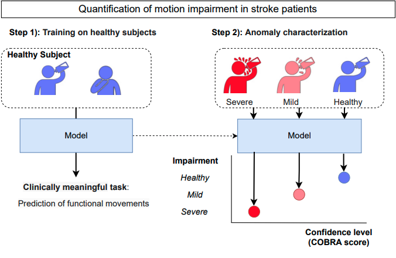
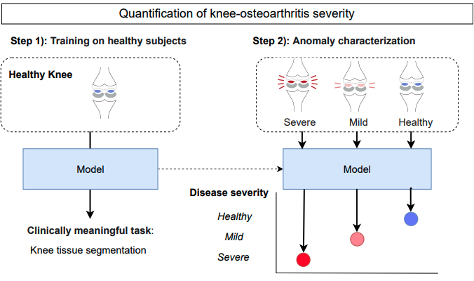
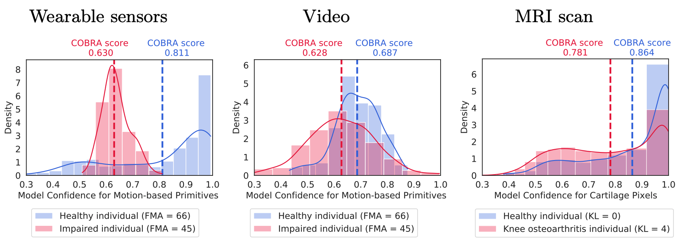
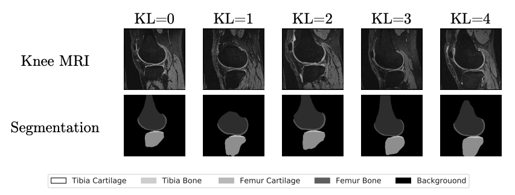
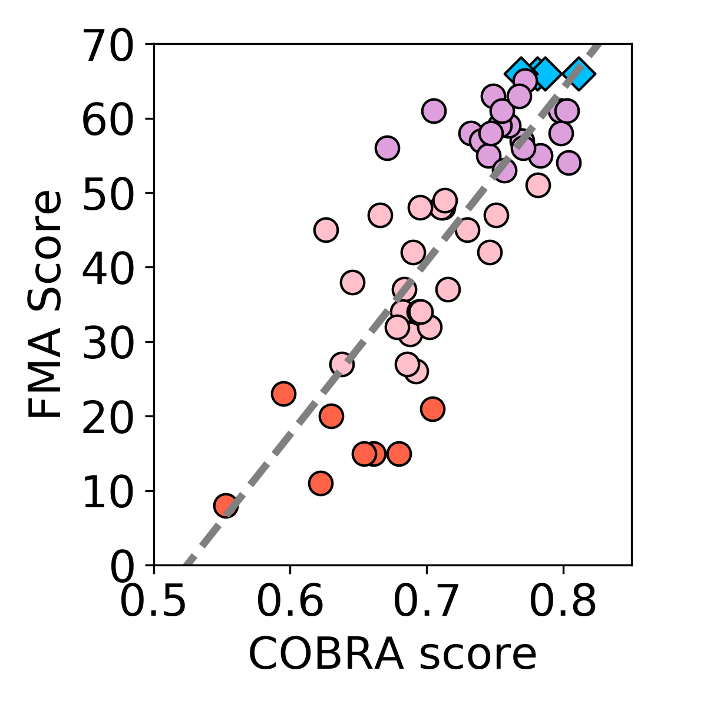
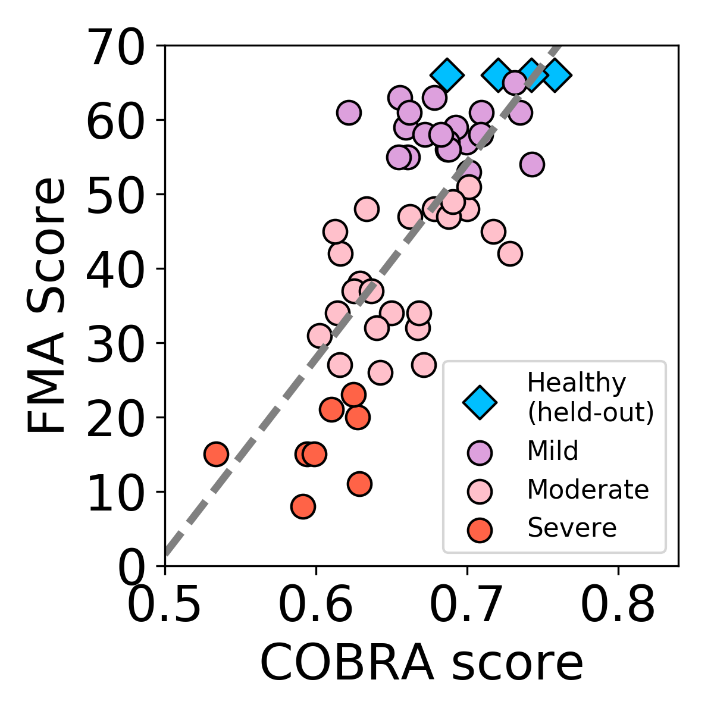
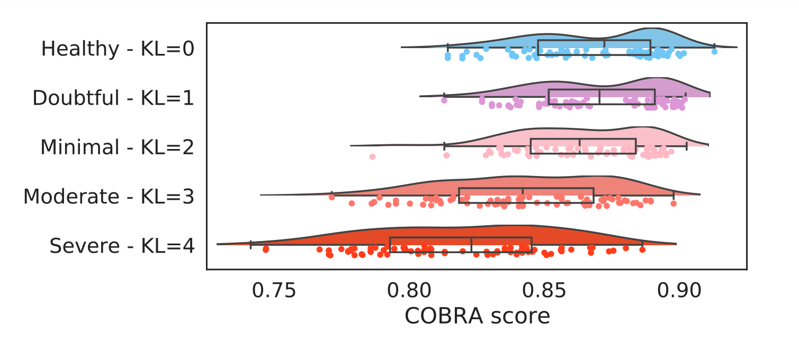

This website contains instructions, codes, and results from **Quantifying Impairment and Disease Severity Using AI Models Trained on Healthy Subjects** by Boyang Yu\*, Aakash Kaku\*, Kangning Liu\*, Avinash Parnandi, Emily Fokas, Anita Venkatesan, Natasha Pandit, Rajesh Ranganath, Heidi Schambra and Carlos Fernandez-Granda [\* - Equal Contribution].

For more information please visit [our GitHub page](https://github.com/fishneck/COBRA/)

Automatic assessment of impairment and disease severity is a key challenge in data-driven medicine. We propose a novel framework, **COnfidence-Based chaRacterization of Anomalies (COBRA)**, to address this challenge, which leverages AI models trained exclusively on healthy subjects. The models are designed to predict a clinically-meaningful attribute of the healthy patients. When presented with data where the attribute is affected by the medical condition of interest, the models experience a decrease in confidence that can be used to quantify deviation from the healthy population. COBRA was applied to quantification of upper-body motion impairment in stroke patients, and severity of knee osteoarthritis from magneticresonance imaging scans.

## COnfidence-Based chaRacterization of Anomalies (COBRA) Framework

In Step 1, an AI model is trained to perform a clinically meaningful task on data from healthy individuals. For impairment quantification in stroke patients, the task is prediction of functional primitive motions from videos or wearable sensor data (top). For severity quantification of knee osteoarthritis, the task is segmentation of knee tissues from magnetic resonance imaging scans (bottom). In Step 2, the COBRA score is computed based on the confidence of the AI model when performing the task on patient data. Data from patients with higher degrees of impairment or severity differ more from the healthy population used for training, which results in decreased model confidence and hence a lower COBRA score.

## Averaging model confidence yields a discriminative characterization score

The average confidence is higher for the healthy subjects. The means of the distributions (dashed lines) are clearly separated. This motivates the definition of the COBRA score as the mean confidence averaged over multiple data points associated to the subject.

## Applications

### Quantification of Impairment in Stroke Patients

The application of the COBRA score to the impairment quantification in stroke patients was carried out using the publicly available StrokeRehab dataset. StrokeRehab contains **wearable-sensor data** and **video data** from a cohort of 29 healthy individuals and 51 stroke patients performing multiple trials of 9 rehabilitation activities.

The impairment level of each patient was quantified via the Fugl-Meyer assessment (FMA). The FMA score is a number between 0 (maximum impairment) and 66 (healthy) equal to the sum of itemized scores (each from 0 to 2) for 33 upper body mobility assessments carried out in-clinic by a trained expert.

### Quantification of Severity of Knee Osteoarthritis

The application of the COBRA score to the quantification of knee osteoarthritis (OA) severity was carried out using the publicly available OAI-ZIB dataset. This dataset provides 3D MRI scans of 101 healthy right knees and 378 right knees affected by knee osteoarthritis (OA), a long-term degenerative joint condition.

Each knee is labeled with the corresponding Kellgren-Lawrence (KL) grades, retrieved from the NIH Osteoarthritis Initiative collection. The KL grade quantifies OA severity on a scale from 0 (healthy) to 4 (severe).

## Results

### Stroke Patients - Wearable sensors and Video

Wearable sensors : ρ = 0.845, 95% CI [0.743,0.908]

Video : ρ = 0.746, 95% C.I [0.594, 0.847]

An independent assessment performed in-clinic by trained experts was shown to be strongly correlated with the COBRA score for both data modalities

### Knee Osteoarthritis 

In addition, the COBRA score was applied to quantify severity of knee osteoarthritis from magneticresonance imaging scans, again achieving significant correlation with an
independent clinical assessment (ρ = 0.658, 95% C.I [0.581,0.734]).

## Confounding factors

The table-top rehabilitation activity in the stroke impairment quantification task involves dark and light-colored objects (top row). The bottom left scatterplot shows the COBRA score computed only using video data from this activity and the corresponding Fugl-Meyer assessment (FMA) score.

The dark objects are difficult to detect, which results in a systematic loss of confidence in the video-based AI model, and hence lower COBRA scores (independently from the FMA score). The bottom middle and right scatterplots show that stratifying according to object color corrects for the confounding factor, improving the correlation coefficient.

## AI Models for Clinically Meaningful Task

### Stroke Patients - Wearable sensors

We trained a model to identify functional primitives from healthy individuals' inertial measurement units (IMUs) data. We utilized a Multi-Stage Temporal Convolutional Network (MS-TCN). We used the model confidence for motion related primitives (transport, reposition, reach) to calculate COBRA score. Source code for model training and calculating COBRA score is in [here](https://github.com/fishneck/COBRA/tree/main/models/stroke_IMU).

### Stroke Patients - Video

We performed functional primitive identification from healthy individuals' video data. We utilized the X3D model, a 3D convolutional neural network designed for primitive classification from video data. We used the model confidence for motion related primitives (transport, reposition, reach) to calculate COBRA score. Source code for model training and calculating COBRA score is in [here](https://github.com/fishneck/COBRA/tree/main/models/stroke_video).

### Knee Osteoarthritis 

We developed a medical segmentation model to predict pixel-wise tissue type on healthy knees. We adopted a Multi-Planar U-Net architecture. We used the model confidence for cartilage tissues (femur cartilage, tibia cartilage) to calculate COBRA score. Source code for model training and calculating COBRA score is in [here](https://github.com/fishneck/COBRA/tree/main/examples/kneeOA).

# Code

Please visit [our GitHub page](https://github.com/fishneck/COBRA/) for data, pre-trained models, code, and instructions on how to use the code.
